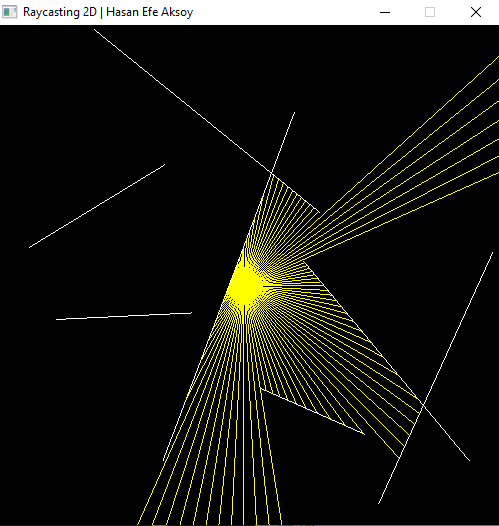

Raycasting 2D
 
<h4>The project used only the glfw library. Not glew, glut etc.</h4>
 
 
I used the line-line intersection formula from the Wikipedia link.
 
<b>Wikipedia Link</b>: https://en.wikipedia.org/wiki/Line%E2%80%93line_intersection
 
You can change colors and transparents, ray counts and wall counts.
 
 
<h4>Preview:</h4>
 

 

